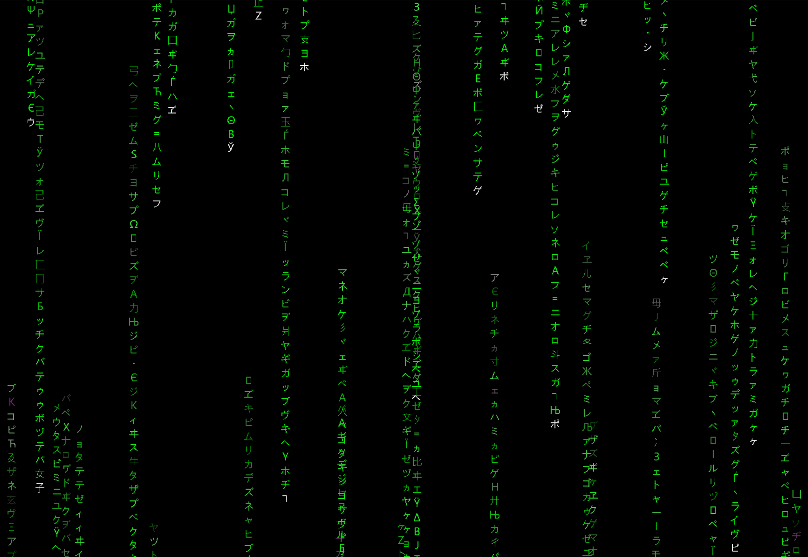

# MATRIX RAIN 

Simple coding exercise to imitate The Matrix Rain effect - a digital shower of symbols!

Inspiration came from the actual films: 
https://en.wikipedia.org/wiki/The_Matrix_(franchise)

A few hints, from this Coding Train tutorial from Emily Xie: 
https://www.youtube.com/watch?v=S1TQCi9axzg

But written in Python with pygame (rather than P5 processing)

